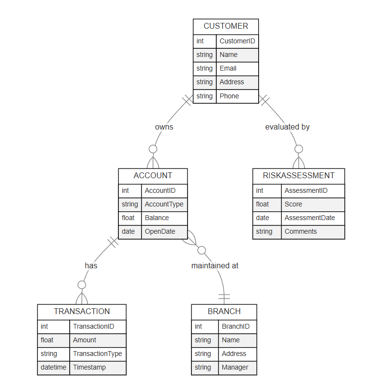

# Assignment 2: From Specification to API
 
## Overview
In this assignment, I developed a basic FastAPI application that demonstrates how to transform my project specification into a working API. The project uses Pydantic models for data validation and implements simple CRUD (Create, Read, Update, Delete) operations for a "Customer" entity. This serves as a foundation for future enhancements, such as adding more entities and integrating a persistent database to be used for the trading application.

## Project Structure
The project is organized as follows:

- **app**: Contains the FastAPI application code.
  - `main.py`: The entry point for the API.
  - `models.py`: Contains the Pydantic models.
  - `routes.py`: Implements the CRUD endpoints.
- **requirements.txt**: Lists all Python packages required for the project.
- **ERD.pdf**: The Entity Relationship Diagram for the project.
- **README.md**: This file, which explains the project details.

## ERD Diagram
Below is the ERD diagram for the project. 



## FastAPI Application Details

### Overview
This FastAPI application is built with Python and leverages Pydantic for data validation. It provides endpoints for basic CRUD operations on the Customer entity.

### Key Endpoints
- **GET `/`**: Returns a welcome message.
- **POST `/customers/`**: Creates a new customer.
- **GET `/customers/`**: Retrieves all customers.
- **GET `/customers/{customer_id}`**: Retrieves a specific customer by ID.
- **PUT `/customers/{customer_id}`**: Updates an existing customer.
- **DELETE `/customers/{customer_id}`**: Deletes a customer.

### How to Run the Application

1. **Set Up and Activate a Virtual Environment:**

   **Windows:**
   - Open Command Prompt and navigate to your project folder (e.g., `C:\Users\Owner\Assignment2`):
     ```
     cd C:\Users\Owner\Assignment2
     ```
   - Create the virtual environment:
     ```
     python -m venv venv
     ```
   - Activate the virtual environment:
     ```
     venv\Scripts\activate
     ```
     (You should see `(venv)` at the beginning of your prompt.)

2. **Install Dependencies:**
   With the virtual environment activated, run:
	pip install -r requirements.txt

3. **Run the Server:**
Start the FastAPI server by running:
	uvicorn app.main:app --reload

The server will be accessible at [http://127.0.0.1:8000](http://127.0.0.1:8000).

4. **Test the API:**
Open your browser and navigate to [http://127.0.0.1:8000/docs](http://127.0.0.1:8000/docs) to access the interactive API documentation provided by FastAPI.

## Code Snippets

### main.py
```python
from fastapi import FastAPI
from app import routes

app = FastAPI(title="My First FastAPI Project")

# Include the router from routes.py
app.include_router(routes.router)

@app.get("/")
def read_root():
 return {"message": "Hello, welcome to my API!"}

if __name__ == "__main__":
 import uvicorn
 uvicorn.run(app, host="127.0.0.1", port=8000)
```

### models.py
```python
from pydantic import BaseModel, Field
from typing import Optional

class Customer(BaseModel):
    customer_id: Optional[int] = Field(None, description="Unique identifier for the customer")
    name: str = Field(..., description="Full name of the customer")
    email: str = Field(..., description="Customer email address")
    address: str = Field(..., description="Customer's physical address")
    phone: str = Field(..., description="Customer's phone number")
```

### routes.py
```python
from fastapi import APIRouter, HTTPException
from typing import List
from app.models import Customer

router = APIRouter()

# In-memory "database" for Customers
customers_db = {}

# Create a Customer
@router.post("/customers/", response_model=Customer)
def create_customer(customer: Customer):
    if customer.customer_id is None:
        customer.customer_id = len(customers_db) + 1
    if customer.customer_id in customers_db:
        raise HTTPException(status_code=400, detail="Customer already exists")
    customers_db[customer.customer_id] = customer
    return customer

# Get All Customers
@router.get("/customers/", response_model=List[Customer])
def read_customers():
    return list(customers_db.values())

# Get a Specific Customer
@router.get("/customers/{customer_id}", response_model=Customer)
def read_customer(customer_id: int):
    customer = customers_db.get(customer_id)
    if not customer:
        raise HTTPException(status_code=404, detail="Customer not found")
    return customer

# Update a Customer
@router.put("/customers/{customer_id}", response_model=Customer)
def update_customer(customer_id: int, customer: Customer):
    if customer_id not in customers_db:
        raise HTTPException(status_code=404, detail="Customer not found")
    customers_db[customer_id] = customer
    return customer

# Delete a Customer
@router.delete("/customers/{customer_id}")
def delete_customer(customer_id: int):
    if customer_id not in customers_db:
        raise HTTPException(status_code=404, detail="Customer not found")
    del customers_db[customer_id]
    return {"detail": "Customer deleted"}
```

## Conclusion
In this project, a detailed specification was successfully transformed into a functional API using FastAPI. The implementation of CRUD operations for the Customer entity, along with data validation through Pydantic models, demonstrates the project's core capabilities. While the current version focuses on a single entity, the architecture lays a solid foundation for future enhancements—such as adding additional entities, incorporating persistent storage, and integrating more complex business logic—to create a comprehensive and scalable API.
