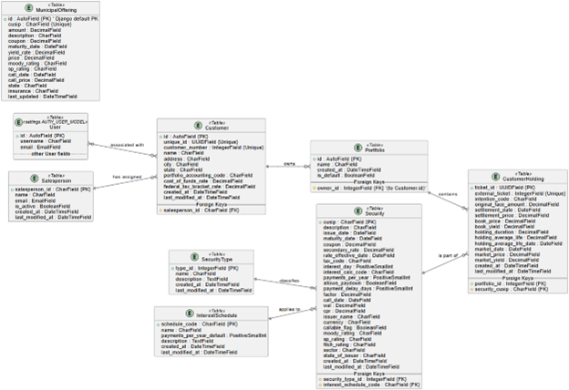

# Portfolio Analysis System Documentation

## Evolution 0

Evolution 0 lays the groundwork for the Portfolio Analysis System by defining the problem domain, the software's purpose, and its high-level design through UML diagrams.

### The Problem Domain

The system operates within the financial services domain, specifically focusing on fixed-income investment portfolio management and analysis. This involves tracking customer-owned bond portfolios, the individual securities within them, and market data associated with these securities. Key activities include portfolio construction, ongoing performance monitoring, risk assessment through various financial metrics, and evaluating potential changes to portfolio composition. Financial institutions, investment advisors, and individual investors often require sophisticated tools to manage the complexities of bond investments, including diverse security types, varying interest calculation methods, and the impact of market fluctuations.

### Problem Addressed

Managing and analyzing bond portfolios quickly is a necessity due to rapid market fluctuations, and performing this task effectively can be a complex and data-intensive venture. Investors and portfolio managers often struggle with:

1.  **Data Aggregation**: Consolidating information about various securities (corporate bonds, municipal bonds, etc.) and customer holdings from disparate sources.
2.  **Complex Calculations**: Accurately calculating crucial financial metrics such as cash flows, yield-to-maturity (YTM), duration, and convexity, which are essential for understanding a portfolio's risk and return profile.
3.  **Portfolio Optimization**: Evaluating the potential impact of buying or selling securities on the overall portfolio's characteristics.
4.  **Timely Updates**: Keeping security master data and market information current to ensure analyses are based on the latest information.

This Portfolio Analysis System aims to address these challenges by providing a centralized platform for managing bond portfolio data, automating complex financial calculations, and offering tools for portfolio simulation and analysis.

### Software Solution's Value

The Portfolio Analysis System offers significant value by:

-   **Centralizing Data**: Providing a single source of truth for customer portfolios, securities, and holdings, simplifying data management and reducing errors.
-   **Automating Analysis**: Automating the calculation of key financial analytics, saving time and providing insights for better investment decisions. This includes cash flow projections, YTM, duration, and convexity.
-   **Facilitating "What-If" Scenarios**: Enabling users (like traders or advisors) to simulate portfolio changes (swaps) and immediately see the potential effects on the portfolio's metrics, aiding in optimization and risk management.
-   **Streamlining Reporting & Monitoring**: Making it easier to view portfolio compositions and their financial characteristics through an API, which can be consumed by frontend applications or other reporting tools.
-   **Improving Efficiency**: Automating data imports (e.g., via Excel uploads and scheduled Celery tasks) reduces manual effort and ensures data is kept up-to-date.
-   **Enhancing Communication**: Allowing for features like email notifications to salespersons regarding customer interest in buying or selling securities.

### UML Design Document

The following UML diagrams provide a visual representation of the system's architecture, structure, and behavior.

#### 1. Activity Diagram

-   **Purpose and Key Elements**: The Activity Diagram illustrates the workflow for a key automated process within the system: the scheduled import of data from Excel files.
-   It shows two main partitions: "Scheduler (Celery Beat)" and "Celery Worker."
-   **Scheduler (Celery Beat)**: Initiates the import process at predefined intervals (e.g., every 10 minutes, as configured in celery.py). It triggers an `import_from_excel` task and enqueues it.
-   **Celery Worker**: Picks up the task from a message queue (e.g., Redis, as suggested by settings.py). It reads Excel files from `/data/imports/`, processes rows by transforming and validating data, then upserts the information into database models (like Customer, Security, Holding) using loader services (as seen in services.py). Finally, it logs a summary of the operation.


#### 2. Class Diagram

-   **Purpose and Key Elements**: Details the static structure of the system, focusing on the main entities (classes), their attributes, and relationships, mapping closely to Django models.
-   **Key Classes**:
    -   **User**: Represents system users (Django's built-in User model) with attributes like username, email, and staff status.
    -   **Customer**: Represents clients with attributes like customer_number, name, address. Has a many-to-many relationship with User and owns Portfolios (1 to 0..*).
    -   **Portfolio**: A collection of holdings for a Customer with attributes like name and created_at. Supports hierarchical relationships (0..1 to 0..*) and contains CustomerHoldings (1 to 0..*).
    -   **Security**: Represents a bond with attributes like cusip (primary key), description, issue_date, maturity_date, coupon, wal, factor.
    -   **CustomerHolding**: An associative entity for a Security held in a Portfolio with attributes like ticket_id (primary key), original_face_amount, settlement_date, book_price, yield_to_maturity. Linked to one Portfolio and one Security.
-   **Relationships**:
    -   Customer owns multiple Portfolios.
    -   Portfolio contains multiple CustomerHoldings.
    -   CustomerHolding references one Security.
    -   User and Customer have a many-to-many relationship.


#### 3. Component Diagram

-   **Purpose and Key Elements**: Shows the high-level architecture, illustrating major software components and their interactions.
-   **Key Components**:
    -   **Browser**: Client interface for HTTPS/JSON requests.
    -   **DRF API**: Handles requests, interacts with Django ORM, and publishes tasks to Celery.
    -   **Django ORM**: Translates Python objects to SQL queries.
    -   **Database (PostgreSQL or SQLite)**: Persistent storage for all data.
    -   **Celery Worker**: Consumes tasks from Redis for imports and notifications.
    -   **Redis (broker & cache)**: Message broker for Celery and potential cache.
-   **Interactions**:
    -   Browser sends requests to DRF API.
    -   DRF API uses Django ORM to query/update Database and publishes tasks to Redis.
    -   Celery Worker consumes tasks from Redis and interacts with Database via Django ORM.


#### 4. Sequence Diagram

-   **Purpose and Key Elements**: Illustrates interactions for the `import_from_excel` task.
-   **Lifelines**: Scheduler (Celery Beat), Redis (Broker), Celery Worker, File System, LoaderService, DB.
-   **Sequence**:
    -   Scheduler enqueues task to Redis.
    -   Redis delivers task to Celery Worker.
    -   Worker lists Excel files in `/data/imports/`.
    -   For each file: reads contents, calls `import_data_from_excel` on LoaderService, upserts records into DB, moves file to archive.
    -   Worker acknowledges task completion to Redis.


#### 5. State Machine Diagram

-   **Purpose and Key Elements**: Depicts the lifecycle of an Import Process or CustomerHolding.
-   **States**:
    -   PendingImport: Awaiting processing.
    -   Active: Actively processed or current.
    -   Settled: Holding reached settlement date.
    -   Archived: Past maturity or archived.
    -   Error: Processing error occurred.
-   **Transitions**:
    -   PendingImport -> Active: Import initiated.
    -   PendingImport -> Error: Initial error.
    -   Active -> Settled: On settlement_date.
    -   Active -> Error: Processing error.
    -   Settled -> Archived: After maturity.
    -   Settled -> Error: Post-settlement error.
    -   Error -> PendingImport: Manual reset.


#### 6. Use Case Diagram

-   **Purpose and Key Elements**: Identifies actors and functionalities.
-   **Actors**:
    -   Admin: System administrator.
    -   Trader: Manages portfolios and swaps.
    -   Salesperson: Interacts with customers.
    -   Customer: Owns portfolios.
-   **Use Cases**:
    -   Manage Securities: Admin.
    -   Import Data: Admin.
    -   Manage Users: Admin.
    -   Execute Transaction: Trader, Admin.
    -   View Portfolio: Admin, Trader, Salesperson, Customer.
    -   Simulate Swap: Admin, Trader, Salesperson.
    -   Contact Trader: Salesperson, Customer.
    -   Contact Salesperson: Customer.


## Evolution 1

### Refined Problem Specification

The system addresses mutiple needs facing managers of fixed-income investments, targeting:

1.  **Granular Portfolio Tracking**: Tracking detailed attributes of holdings (settlement date, book price, market valuation, coupon, yield, WAL, duration).
2.  **Dynamic Data Management**: Robust import mechanism for periodic updates of security, customer, and holding data via Excel.
3.  **Role-Based Access**: Tailored functionalities for Admins, Traders, Salespersons, Customers.
4.  **Actionable Insights**: Tools for "what-if" swap simulations to adjust portfolios.
5.  **Diverse Security Attributes**: Handling call dates, tax codes, payment frequencies, interest calculations, credit ratings.
6.  **Communication**: Notifying salespersons of customer interest.

### Logical Organization of Solution into Features/Modules

1.  **Core Data Management (CRUD)**:
    -   Customer Management: Via CustomerViewSet, CustomerSerializer.
    -   Security Master Management: Via SecurityViewSet, SecuritySerializer.
    -   Portfolio Management: Via PortfolioViewSet, PortfolioSerializer.
    -   Customer Holding Management: Via CustomerHoldingViewSet, CustomerHoldingSerializer.
    -   Salesperson Management: Via SalespersonSerializer.
    -   Municipal Offerings Viewer: Via MunicipalOfferingViewSet, MunicipalOfferingSerializer.

2.  **Data Import Subsystem**:
    -   Excel-Based Data Import: Via ImportExcelView, Celery tasks (e.g., `import_securities_from_excel`).
    -   Scheduled Automated Imports: Configured in celery.py, depicted in Activity and Sequence Diagrams.

3.  **Financial Analysis & Calculation Engine**:
    -   Cash Flow Generation: Via `generate_quantlib_cashflows` in utils.py.
    -   Bond Analytics: Via `calculate_bond_analytics` in utils.py.
    -   Aggregated Portfolio Cash Flows: Via PortfolioViewSet's `aggregated_cash_flows`.

4.  **Portfolio Simulation Feature**:
    -   Swap Simulation: Via PortfolioViewSet's `simulate_swap`, PortfolioSimulationSerializer.

5.  **Notification & Communication**:
    -   Salesperson Email Notifications: Via EmailSalespersonInterestView, EmailSalespersonMuniBuyInterestView, Celery tasks.

6.  **User and Access Management**:
    -   Authentication & Permissions: Via Django authentication, DRF permissions.

### Updated Per-Feature Diagrams

-   **Use Case Diagram**: Shows actor interactions with features.
-   **Activity & Sequence Diagrams**: Detail Data Import Subsystem.
-   **Class Diagram**: Defines data structures for all features.
-   **Component Diagram**: Shows component collaboration.
-   **State Machine Diagram**: Illustrates import process lifecycle.

## Evolution 2



## Evolution 4: Django Implementation

### Django Project Structure

-   **Project Directory (bondsystem)**:
    -   **settings.py**: Configures database (SQLite default), apps, middleware, templates, static files, DRF, Celery, email, logging.
    -   **urls.py**: Routes for admin, DRF auth, API endpoints, frontend view.
    -   **celery.py**: Initializes Celery, configures tasks and schedules.
    -   **wsgi.py / asgi.py**: For deployment.

-   **Application Directory (portfolio)**:
    -   **models.py**: Defines Customer, Security, Portfolio, CustomerHolding, MunicipalOffering, Salesperson, SecurityType, InterestSchedule.
    -   **views.py**: DRF ModelViewSets for CRUD, APIViews for custom actions.
    -   **serializers.py**: ModelSerializers and custom serializers.
    -   **admin.py**: Customizes Django admin interface.
    -   **tasks.py**: Celery tasks for imports and notifications.
    -   **utils.py**: Financial computation functions.
    -   **filters.py**: Custom filter sets.
    -   **services.py**: Service-layer functions for imports.
    -   **apps.py**: Application configuration.
    -   **migrations/**: Database schema management.
    -   **tests/**: Unit and integration tests.

-   **Static & Template Files**:
    -   **frontend/**: Holds index.html and static assets.
    -   **staticfiles/**: Collected static files for deployment.

### API Implementation

-   **Serializers**:
    -   ModelSerializers for each model.
    -   Nested serializers for relationships.
    -   Write-only fields for ID inputs.
    -   SerializerMethodField for calculated fields.
    -   Custom serializers for uploads, notifications, simulations.

-   **ViewSets and APIViews**:
    -   ModelViewSets for CRUD: CustomerViewSet, SecurityViewSet, PortfolioViewSet, CustomerHoldingViewSet, MunicipalOfferingViewSet.
    -   Custom actions: `simulate_swap`, `aggregated_cash_flows`, `cash_flows`, `financial_analysis`.
    -   APIView/GenericAPIView for imports, notifications.

-   **Routers and URLs**:
    -   DefaultRouter for ViewSet URLs under `/api/`.
    -   Manual paths for APIView endpoints.
    -   Includes DRF auth and token auth URLs.

## Evolution 5

### Domain-Driven Design (DDD) Glossary

| Term                | Definition                                                                                                  |
|---------------------|-------------------------------------------------------------------------------------------------------------|
| Customer            | Institutional or individual account owner whose bond holdings are managed.                                   |
| Portfolio           | Named collection of bond holdings; may be hierarchical.                                                     |
| CustomerHolding     | Snapshot of a Security owned by a Customer (face amount, prices, yields, dates).                            |
| Security            | Fixed-income instrument (bond) identified by CUSIP, with coupon, maturity, conventions.                     |
| Swap Simulation     | “What-if” calculation replacing holdings, computing P&L/WAL/YTM changes.                                |
| Default Portfolio   | Automatically created Portfolio for a Customer for initial imports.                                          |
| Import Task         | Background job (Celery task) reading Excel and upserting Customers, Securities, or Holdings.                |
| Ubiquitous Language | Shared vocabulary (“Portfolio”, “Holding”, “simulate_swap”) used by developers, traders, and sales. |

### Scenario 1: Import Securities on Schedule

```gherkin
Feature: Scheduled Data Ingestion
  As an Admin
  I want the system to import bond master data automatically
  So that the API always reflects the latest feed

  Background:
    Given there is an Excel file "sample_securities.xlsx" in /data/imports

  Scenario: Celery-Beat triggers securities import every 10 minutes
    When the Celery-Beat schedule fires
    Then the import_securities_from_excel task runs
    And each row in the sheet is upserted into the Security table
    And the API returns the new list at GET /api/securities/

### Scenario 2: Swap Simulation

```gherkin
 Feature: Swap Simulation
  As a Trader
  I want to propose replacing bonds in my portfolio
  So that I can see changes in yield, WAL, and net benefit

  Background:
    Given a Portfolio "Pilot Portfolio" with holdings A (face=100), B (face=50)

  Scenario: User runs a “what-if” swap
    When I POST to /api/portfolios/{id}/simulate_swap/ with
      | add_security_id   | 5     | face_amount | 80    | price | 101.5 |
      | remove_holding_id | 2     |
    Then the response contains
      | before_total_face | 150 | after_total_face | 150 |
      | delta_wal         | …   | delta_net_benefit | … |
    And no actual holdings are modified

### Scenario 3: Portfolio Visualization

```gherkin
Feature: Portfolio Visualization
  As a Customer
  I want to see my current bond holdings and key metrics
  So that I can understand my risk and return

  Background:
    Given I am authenticated as Customer “CUST-100”
    And I have a Portfolio “P1” with holdings:
      | security | AAA | face_amount | 100 |
      | security | BBB | face_amount | 50  |

  Scenario: Customer views portfolio detail
    When I GET /api/portfolios/1/
    Then the response status is 200
    And the JSON includes:
      | name      | P1            |
      | owner     | CUST-100      |
    And under “holdings” I see two entries with:
      | security_cusip | AAA |
      | original_face_amount | 100.00 |
      | security_cusip | BBB |
      | original_face_amount | 50.00 |
    And each holding shows computed fields:
      | book_price | … |
      | book_yield | … |
      | wal        | … |
